# UTS (Pertemuan ke 8) 

|Nama|NIM|Kelas|Mata Kuliah|
|----|---|-----|------|
|**Radityatama Nugraha**|**312310644**|**TI.23.A3**|**Manajemen Basis Data**|

# Soal 1:
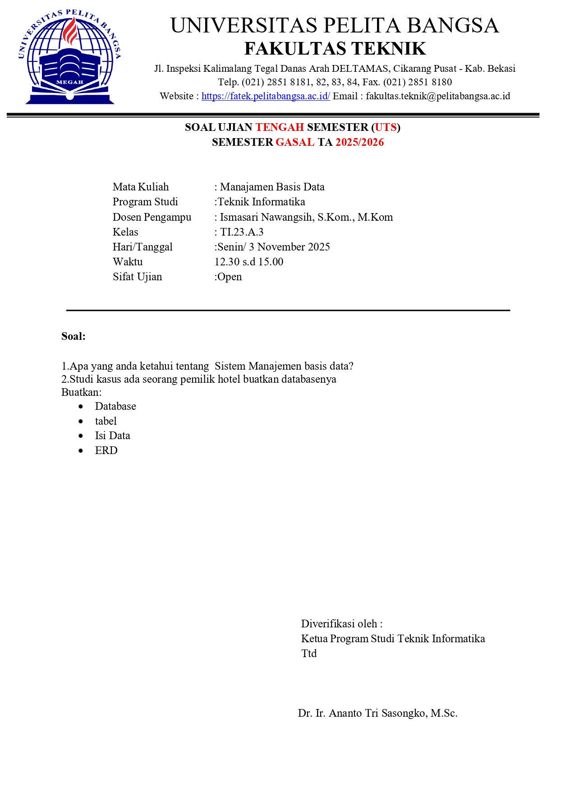

## - Apa yang anda ketahui tentang Sistem Manajemen Basis Data
### - Sistem Manajemen Basis Data (Database Management System / DBMS) adalah perangkat lunak yang digunakan untuk mengelola, menyimpan, dan mengatur data dalam basis data secara efisien. DBMS bertugas untuk menghubungkan antara pengguna (user) atau aplikasi dengan basis data agar proses seperti penyimpanan, pengambilan, pembaruan, dan penghapusan data bisa dilakukan dengan aman dan teratur. 

## - Studi kasus ada seseorang pemilik hotel buatkan database nya Buatkan:

## - Untuk Memulai Codingan Database di XAMPP dan ke Shell
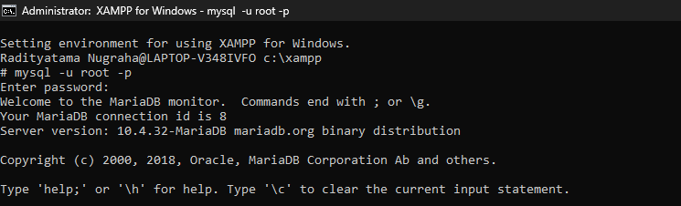

## - Membuat dan memilih database hotel dengan perintah CREATE DATABASE hotel_db; dan USE hotel_db;.
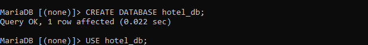

## - Membuat tabel tamu di database hotel dengan perintah CREATE TABLE tamu, untuk menyimpan data tamu seperti ID, nama, KTP, alamat, dan nomor telepon.
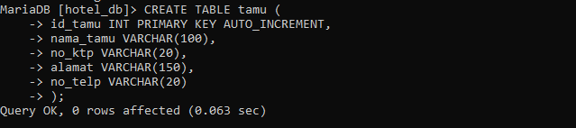

## - Membuat tabel kamar di database hotel dengan perintah CREATE TABLE kamar, untuk menyimpan data kamar seperti ID, tipe kamar, harga per malam, dan status.
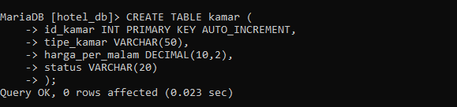

## - Membuat tabel reservasi di database hotel dengan perintah CREATE TABLE reservasi, untuk menyimpan data pemesanan kamar oleh tamu.
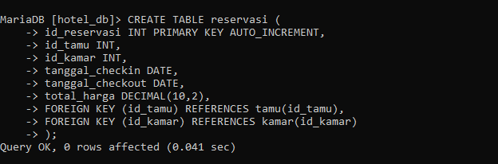

## - Membuat tabel pembayaran di database hotel dengan perintah CREATE TABLE pembayaran, untuk menyimpan data transaksi pembayaran dari tamu.
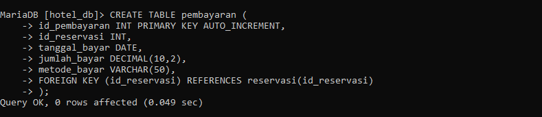

## - Menambahkan data tamu ke tabel tamu di database hotel dengan perintah INSERT INTO tamu, VALUES, untuk menyimpan informasi tamu baru.
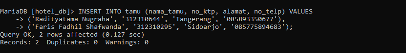

## - Menampilkan seluruh data tamu dari tabel tamu dengan perintah SELECT * FROM tamu; untuk melihat isi data tamu yang telah dimasukkan.
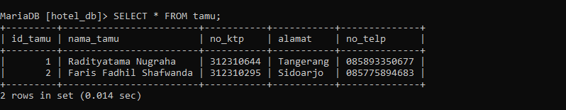

## - Menambahkan data kamar ke tabel kamar dengan perintah INSERT INTO kamar, VALUES, untuk menyimpan informasi tipe kamar, harga, dan status ketersediaan.
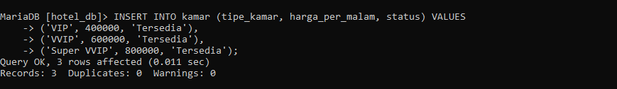

## - Menampilkan seluruh data kamar dari tabel kamar dengan perintah SELECT * FROM kamar; untuk melihat daftar kamar yang tersedia di hotel.
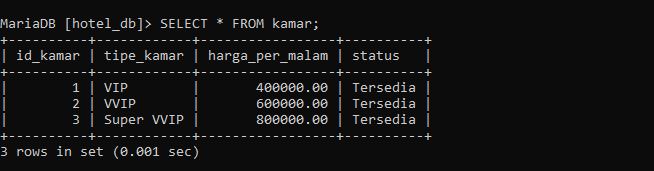

## - Menambahkan data reservasi ke tabel reservasi dengan perintah INSERT INTO reservasi, VALUES, untuk mencatat pemesanan kamar oleh tamu.
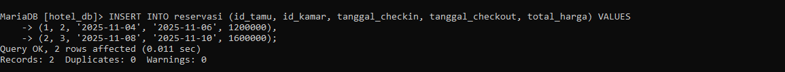

## - Menampilkan seluruh data reservasi dari tabel reservasi dengan perintah SELECT * FROM reservasi; untuk melihat daftar pemesanan kamar oleh tamu.
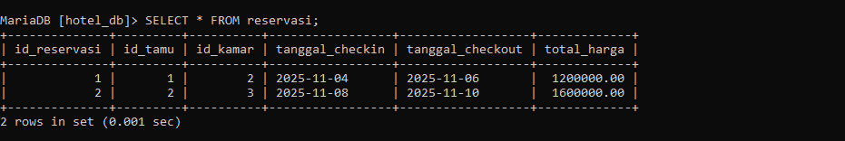

## - Menambahkan data pembayaran ke tabel pembayaran dengan perintah INSERT INTO pembayaran, VALUES, untuk mencatat transaksi pembayaran dari tamu.
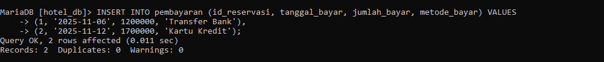

## - Menampilkan seluruh data pembayaran dari tabel pembayaran dengan perintah SELECT * FROM pembayaran; untuk melihat riwayat transaksi pembayaran dari tamu.
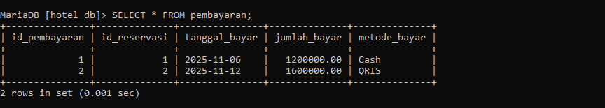

## ERD
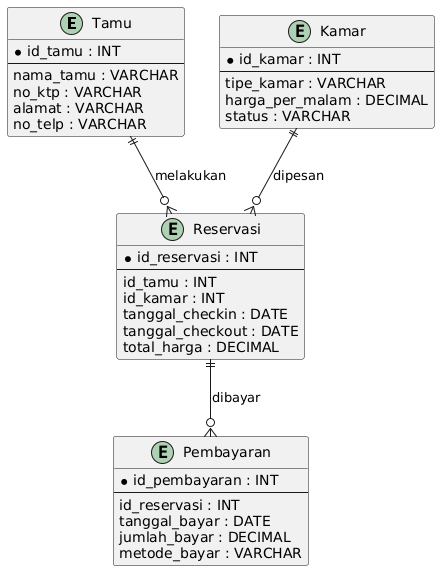

